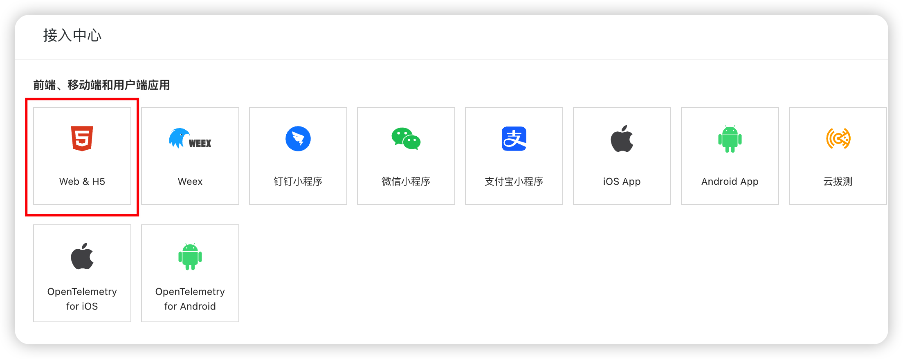
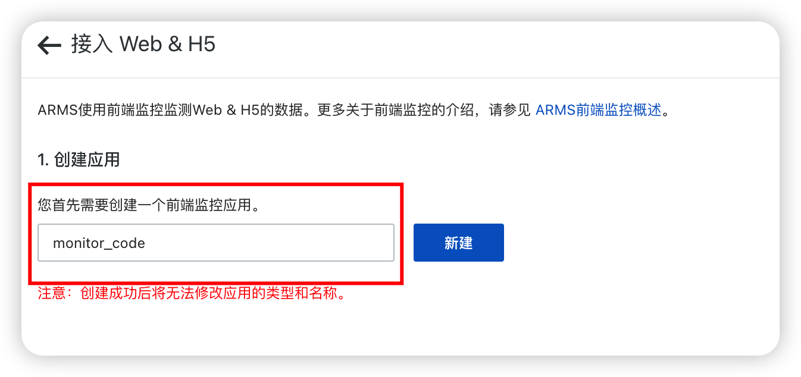
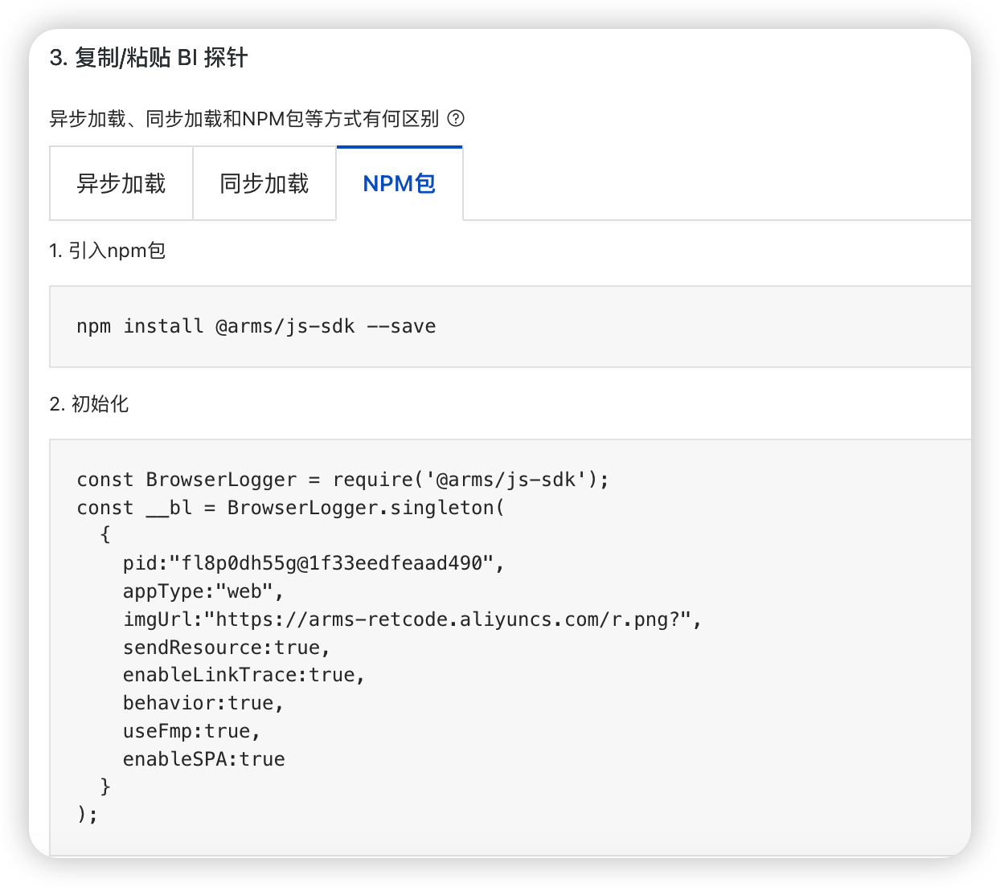
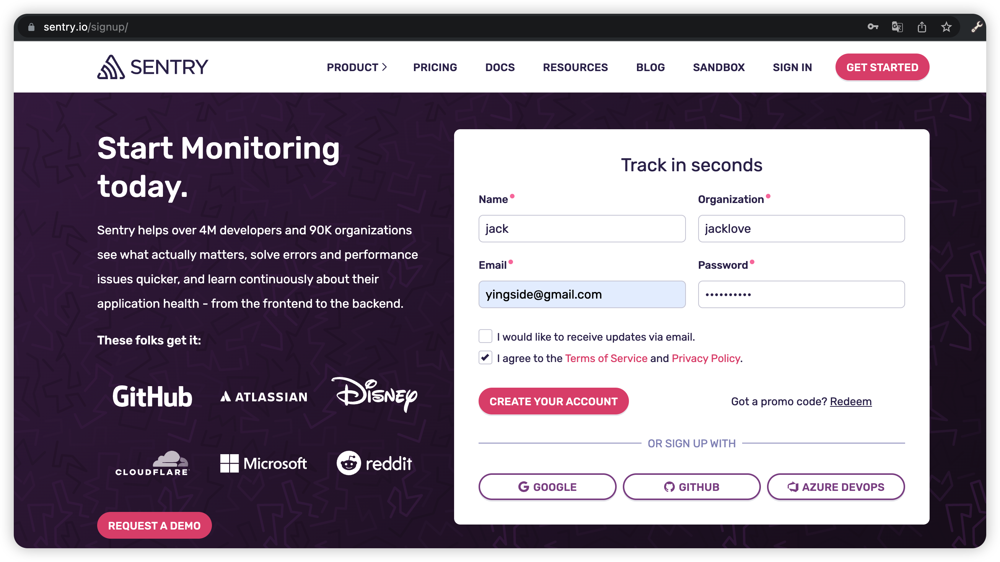
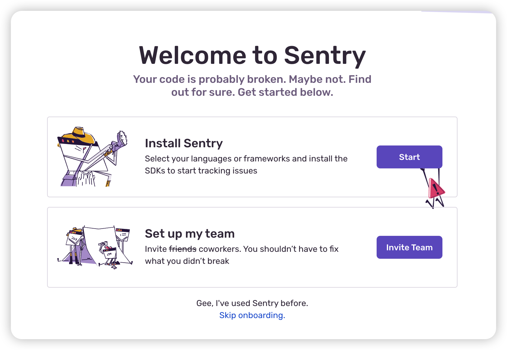
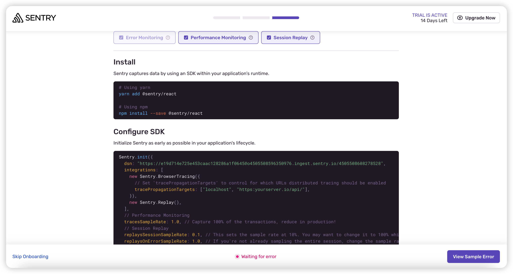

# 前端服务监控与手写监控SDK

## 前端服务监控概述

前端监控的目的很明确，无非就是让我们的产品更完善，更符合我们和用户的需求。运营与产品团队需要关注用户在产品内的行为记录，通过用户的行为记录来优化产品，研发与测试团队则需要关注产品的性能以及异常，确保产品的性能体验以及安全迭代。

而一个完整的前端监控平台至少需要包括三个部分：**数据采集与上报、数据整理和存储、数据展示**。算上需要监控的项目的话，也就是说，至少需要4个项目才能完整的记录前端监控的内容。

下图是一个完整的前端监控平台需要处理和解决的问题：


这么大一张图，估计大家看着也脑子发晕，而且这张图很多地方由于内容太多，还是省略之后的。

其实要做前端监控，很多时候，我们可以借助现成的平台去做

1、[sentry](https://sentry.io/welcome/)

2、灯塔

3、[阿里ARMS](https://www.aliyun.com/product/arms)

4、神策

......

无论如何，我们至少先看看前端监控到底在监控什么内容

### 阿里ARMS基本使用









### Sentry








```javascript
//安装
npm install --save @sentry/react

//项目中配置SDK
import * as Sentry from "@sentry/react";
Sentry.init({
  dsn: "https://e19d714e725e453caac128286a1f0645@o4505508596350976.ingest.sentry.io/4505508608278528",
  integrations: [
    new Sentry.BrowserTracing({
      // Set 'tracePropagationTargets' to control for which URLs distributed tracing should be enabled
      tracePropagationTargets: ["localhost", "https:yourserver.io/api/"],
    }),
    new Sentry.Replay(),
  ],
  // Performance Monitoring
  tracesSampleRate: 1.0, // Capture 100% of the transactions, reduce in production!
  // Session Replay
  replaysSessionSampleRate: 0.1, // This sets the sample rate at 10%. You may want to change it to 100% while in development and then sample at a lower rate in production.
  replaysOnErrorSampleRate: 1.0, // If you're not already sampling the entire session, change the sample rate to 100% when sampling sessions where errors occur.
});

const container = document.getElementById(“app”);
const root = createRoot(container);
root.render(<App />)
```


### 一些名称的解释

#### 监控SDK

通过上面两个现成的框架，大家也大致能看出，我们前端监控到底是要干什么事情

- `页面的性能情况`：包括各阶段加载耗时，一些关键性的用户体验指标等

- `用户的行为情况`：包括PV、UV、访问来路，路由跳转等

- `接口的调用情况`：通过http访问的外部接口的成功率、耗时情况等

- `页面的稳定情况`：各种前端异常等

- `数据上报`：如何将监控捕获到的数据上报

其实完整的监控平台至少分为三大类

- **数据采集与上报**
- 数据整理和存储
- 数据展示

而上面总结的那一大堆，主要就是监控SDK的实现，SDK，其实就是*Software Development Kit*，其实就是提供实现监控的API

#### 前端埋点

无论性能，行为还是异常情况，我们都需要在需要监控的项目代码中去监听这些内容。那么具体监听的手段其实就被称之为**前端埋点**。

前端埋点还分为**手动埋点**和**无痕埋点**。

**手动埋点**，就是在要监听的项目中的某段代码或者某个事件中加入一段监听SDK代码，然后对监听的内容进行上报，好处就是可以对关键性行为做出具体的跟踪，坏处是具有侵入性

**无痕埋点**，就是就是对监听的项目进行全部无脑监听，比如点击事件，滚动事件等等，只要触发了就上报。好处就是对代码没有侵入性，坏处当然也很明显无法快速定位关键信息，上报次数多，服务器压力大

